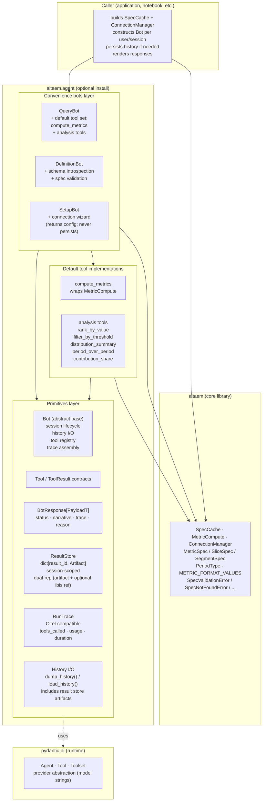
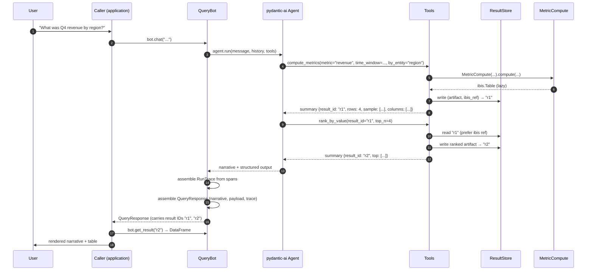

# Section 3 — Component Architecture

## Purpose

This section names the components of `aitaem.agent`, describes what each owns, and shows how they relate. Architectural detail only — no public method signatures, no field-level schemas. Those belong in implementation plans.

---

## 1. Component map



---

## 2. The primitives layer

These are the lower-level constructs the convenience bots are built from, and the public surface for users composing their own bots.

### Bot (abstract base)

The base class behind `QueryBot`, `DefinitionBot`, `SetupBot`. Owns:

- The underlying pydantic-ai `Agent` instance
- The result store
- Conversation history (when in `chat()` mode)
- The tool registry
- Trace assembly per turn
- For bots that compute metrics: a single `MetricCompute` instance held for the bot's lifetime (AD-16)

Exposes `ask()` (single-turn, stateless w.r.t. history), `chat()` (multi-turn), `dump_history()` / `load_history()`, `get_result()`, `add_tool()`, `reset()`. Generic `add_bot()` / `as_tool()` bot-as-tool composition is deferred — see Section 7, ND-11.

Subclasses (the convenience bots) configure the base with their default tool set, default prompts, and bot-specific response type.

### Tool / ToolResult contracts

Tools are pydantic-ai-compatible callables with two distinguishing concerns for this module:

- **They write to the result store.** Every tool that produces an artifact writes it to `ResultStore` at a new ID and returns that ID in its LLM-facing summary.
- **They return minimal LLM-facing summaries.** Not the full artifact. The summary is what the LLM sees; the artifact is what the caller eventually retrieves.

A small `ToolResult` protocol formalizes this — a dict-like structure with `result_id`, `summary` (LLM-facing), and `error` (optional).

### BotResponse[PayloadT]

The base response shape, parameterized by payload type. Fields:

- `status: Status` (enum: `ok | empty | refused | error`)
- `narrative: str`
- `payload: PayloadT | None` (None when status is not ok)
- `trace: RunTrace`
- `reason: str | None` (populated on refused or error)

Subclasses for each bot type narrow `PayloadT`. The base is uniform; bot-specific concerns live in the payload subclass.

### ResultStore

A `dict[str, Artifact]` field on the bot.

- **Session-scoped** — lifetime equals bot lifetime; cleared on `bot.reset()` or GC.
- **Dual representation per entry** (post-Ibis migration): each entry carries the materialized artifact (Arrow table, lazily promotable to pandas) *and* optionally a live Ibis ref. The Ibis ref is session-only; the materialized artifact survives history dump/load.
- **Result IDs are stable strings** (e.g. UUIDs or monotonically increasing integers as strings). Tools generate them on write; the bot exposes `get_result(id)` for retrieval.

### RunTrace

Per-turn aggregated trace, OpenTelemetry-compatible by design.

- `run_id: str` (UUID for correlation)
- `model: str` (the LLM identifier used)
- `tools_called: list[ToolCall]` — each entry: name, args (structured dict), result_id (if any), summary returned to LLM, success, duration
- `usage` — token counts (input, output, total)
- `duration_ms: int`

Designed eval-friendly: `(model, history-before-turn, user message, RunTrace)` is sufficient to replay the turn in an eval harness.

### History I/O

`dump_history()` returns a JSON-serializable record of the conversation. **Includes both messages and the referenced result store artifacts.** `load_history()` (accepted via bot constructor) restores both.

This is the only durable artifact across processes. Tool result store + Ibis refs do not survive serialization beyond their materialized representations.

---

## 3. The convenience bots layer

Each convenience bot is an opinionated assembly of:
- A default system prompt
- A default tool set
- A bot-specific response payload type
- Optionally, additional construction parameters beyond the universal three (SpecCache, ConnectionManager, model)

### Bot constructor shape — the universal pattern

All convenience bots share a constructor shape that separates the bot's own concerns from passthrough operational config:

```
Bot(
    # ── Bot's own concerns (LLM / agent / session) ──
    model: str,
    history: list[Message] | None = None,
    tools: list[Tool] | None = None,

    # ── AITAEM operational inputs ──
    spec_cache: SpecCache,
    connection_manager: ConnectionManager,

    # ── AITAEM passthrough config (bots that construct MetricCompute) ──
    compute_kwargs: dict[str, Any] | None = None,
)
```

`compute_kwargs` is the opaque pass-through to `MetricCompute(...)` (AD-17). The bot has no opinion on AITAEM operational parameters; whatever the caller provides is forwarded. Bots that don't construct `MetricCompute` (DefinitionBot, SetupBot) don't expose `compute_kwargs`.

### QueryBot

Answers natural-language questions against the spec catalog by calling `compute_metrics` and analysis tools.

- **Holds a `MetricCompute` instance** at construction (using `spec_cache`, `connection_manager`, and any `compute_kwargs`), reused across all tool calls in the bot's lifetime (AD-16).
- **Default tool set:** `compute_metrics` + analysis tools (`rank_by_value`, `filter_by_threshold`, `distribution_summary`, `period_over_period`, `contribution_share`).
- **Payload (`QueryPayload`)** carries the result IDs of artifacts produced this turn, plus metadata: spec(s) used, time window applied, period type, by_entity, format hints, and references into the result store.
- **Guardrails (default):** the Metric Precision Rule (refuse with status=refused when no spec precisely answers, rather than substituting a "close enough" metric). Validated against real-world usage patterns; shipped as the AITAEM default.

### DefinitionBot

Helps a user define new specs by inspecting backend schema and generating valid YAML.

- **Inputs:** an `IbisConnector` (via the `ConnectionManager`) for schema introspection; the user's intent string.
- **Default tool set:** internal — `list_tables`, `describe_table`, `validate_spec` (calls `*Spec.from_string().validate()`).
- **Payload (`DefinitionPayload`)** carries the generated YAML, the spec type (metric/slice/segment), the explanation of choices made, and any post-generation validation warnings (using AITAEM's `referenced_columns` to flag cross-table references).

### SetupBot

Helps a user configure a backend connection.

- **Inputs:** user intent + the list of supported backends (DuckDB, BigQuery, etc.).
- **Default tool set:** internal — `validate_connection` (attempts to register and test a connection in a sandboxed `ConnectionManager`).
- **Payload (`SetupPayload`)** carries a config dict (e.g. `{"backend": "bigquery", "project_id": "...", "credentials_path": "..."}`) and a validation result. **Does not persist; the caller owns persistence and credential handling.**

---

## 4. Default tool implementations

`compute_metrics` and the five analysis tools ship as default tools attached to `QueryBot`. They are documented as part of the public surface so users can subclass or compose them in custom bots.

### `compute_metrics`

The single AITAEM-touching tool.

- Calls `.compute(...)` on the bot's held `MetricCompute` instance (AD-16); does not instantiate one per call.
- Returns an Ibis table reference (AITAEM v0.4.0+); writes both the materialized Arrow artifact and the Ibis ref to the result store.
- LLM-facing summary: spec name(s), time window, row count, sample of up to 5 rows, column names, any format metadata.
- Catches `SpecNotFoundError`, `QueryBuildError`, `QueryExecutionError`, `AitaemConnectionError`; returns error dicts. Never raises.

### Analysis tools

Each consumes an existing result store entry (referenced by `result_id`) and produces a new entry.

- `rank_by_value(result_id, top_n, ascending)` — order STANDARD_COLUMNS rows by `metric_value`, take top N.
- `filter_by_threshold(result_id, column, op, value)` — filter rows by predicate.
- `distribution_summary(result_id)` — compute mean, median, percentiles, stddev over `metric_value`.
- `period_over_period(result_id)` — for time-series results, compute deltas and percent changes between periods.
- `contribution_share(result_id, group_by)` — compute each row's share of total and cumulative share.

Each tool operates in lazy mode (Ibis expressions, predicate pushdown) when the Ibis ref is alive; eager mode (Arrow / pandas) when only the materialized artifact is available. The choice is internal to each tool; the LLM never sees the difference.

**LLM-facing summary** for each: the key statistic(s) and a small sample of rows. Enough to ground a narrative; not the full output.

---

## 5. Data flow in a typical turn



Notes on the flow:

- **Step 2 → 12.** The LLM never sees the full DataFrame. It sees summaries; it produces narrative.
- **Step 7.** The ranked artifact is a new result store entry, addressable independently. If the caller wants the unranked data, `get_result("r1")` retrieves it.
- **Step 12.** Result retrieval is on-demand. Lightweight responses, no memory pressure from passing artifacts around.

---

## 6. Caller responsibilities

The agent module's boundary is "stateless on external resources." This means the caller (the consuming application, a notebook user, a custom integration) owns:

| Concern | Caller does | Library does |
|---|---|---|
| Building `SpecCache` | Yes (from their spec store) | Consumes |
| Building `ConnectionManager` | Yes (with credentials) | Consumes |
| Choosing LLM model | Yes (model string) | Consumes |
| Per-user / per-request lifecycle | Yes (constructs bot per scope) | Bot doesn't assume tenancy |
| Persisting history | Optional (`dump_history()`/`load_history()`) | Provides hooks |
| Persisting results across processes | Via `dump_history()` | Provides hooks |
| Rendering results | Yes (UI, CLI, etc.) | Returns structured response |
| Auth, RBAC, multi-tenancy | Yes | Out of scope |

---

## 7. What's deliberately not a component

These are decisions to *not* introduce structure that would expand v1 scope:

- **No `Session` type.** The bot is the session.
- **No `EventEmitter` / observability hook surface.** Aggregated trace on the response is enough for v1.
- **No prompt override registry.** Default prompts are subclass-overridable; a richer customization API is post-v1.
- **No error taxonomy class hierarchy.** `Status.error` + `reason: str` is enough for v1.
- **No streaming response API.** Same shape; chunks are a future API extension.
