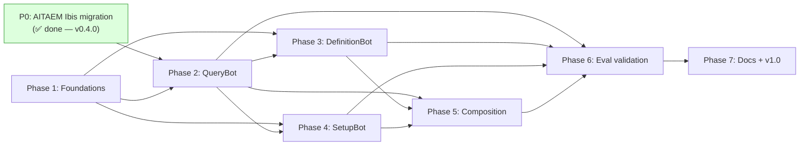

# Section 8 — Implementation Order

## Purpose

This section sequences the implementation work in dependency order. Each phase is described at the architectural level — what gets built, why it must come before what follows, and what's blocked until it lands. Detailed implementation plans (file lists, public method signatures, test cases) are downstream of this document — likely produced by Claude Code consuming each phase as a unit.

---

## 0. Hard prerequisite (in AITAEM core, not the agent module) — ✅ COMPLETE

### P0 — AITAEM Ibis-return migration ✅ Shipped in AITAEM v0.4.0

**What:** `MetricCompute.compute()` returns `ibis.Table` instead of `pandas.DataFrame`. Materialization is explicit via `.to_pandas()` / `.to_pyarrow()`. Also delivered in v0.4.0: `tmp_dir` parameter for cross-backend scratch DuckDB.

**Status:** Done. The agent module can now build directly against the Ibis-return shape. AD-12, AD-16, AD-17 in Section 2 reflect the v0.4.0 reality.

**What this unblocks:** All of Phase 2 onward. Phase 1 (foundations) was already independent of this prerequisite and can start immediately or in parallel with Phase 2 prep.

---

## Phase 1 — Foundations

The minimum scaffolding for everything that follows. Can be developed in parallel with P0.

### P1.1 — Package structure and optional install plumbing

**What:**
- `aitaem.agent` subpackage with `__init__.py` and empty top-level files.
- `pyproject.toml` updated: `agent` extra includes `pydantic-ai[anthropic,openai,...]` and `pydantic-evals` (if shipping reference evals).
- Import-graph CI check enforcing `aitaem.* → aitaem.agent` is forbidden.

**Why first:** Settling the install contract before any internal code so structure can't drift.

**Blocks:** Every subsequent phase imports through this structure.

### P1.2 — Primitives skeleton

**What:**
- `Bot` abstract base class with method signatures and docstrings — no logic.
- `BotResponse[PayloadT]`, `Status` enum, `RunTrace`, `ToolCall`, `Usage` Pydantic models.
- `ResultStore` class with the dual-representation entry shape.
- History I/O surface (`dump_history()` / `load_history()` signatures).

**Why now:** This is the public surface of the primitives layer. Stubbing it first lets P2 / P3 / P4 import and reference real types.

**Blocks:** Convenience bots, default tools.

### P1.3 — Trace assembly from pydantic-ai

**What:** Convert pydantic-ai's internal trace (or OTel spans) into the `RunTrace` shape returned on responses. This is the substrate the eval framework choice depends on, so getting the shape right early matters.

**Why now:** Trace shape is the eval contract (Section 5). Errors here would propagate.

**Blocks:** Anything that returns a real response (every subsequent phase).

---

## Phase 2 — Core QueryBot (post-P0)

The first convenience bot, and the most architecturally load-bearing.

### P2.1 — `compute_metrics` tool against AITAEM v0.4.0

**What:** The tool that calls `.compute(...)` on the bot's held `MetricCompute` instance (AD-16). Writes (Arrow artifact, Ibis ref) to result store. Returns minimal LLM-facing summary. Catches AITAEM exceptions; returns error dicts.

**Why first inside Phase 2:** Every QueryBot turn that does anything useful starts with this tool. Analysis tools depend on result store entries it creates. Construction of the `MetricCompute` itself happens in the `QueryBot` constructor (P2.4), using `spec_cache`, `connection_manager`, and `compute_kwargs` (AD-17).

**Tool summary contract (applies to all Phase 2+ tools):** A tool's return value — the string that becomes `ToolReturnPart.content` and is stored in `ToolCall.llm_summary` — must be a compact, human/LLM-readable snippet. It must never contain raw result data. Metric tables can be thousands of rows; putting that in the summary would overflow context and pollute traces/logs. The full result lives in `ResultStore` only, referenced by `ToolCall.result_id`. A good summary for `compute_metrics` looks like: `"Computed 3 metrics across 2 slices. result_id=abc123"`. Each tool is responsible for producing its own summary string — there is no shared truncation utility.

**Blocks:** Analysis tools, QueryBot integration.

### P2.2 — Analysis tools (lazy-mode-aware)

**What:** `rank_by_value`, `filter_by_threshold`, `distribution_summary`, `period_over_period`, `contribution_share`. Each:
- Reads a prior result store entry by ID.
- Prefers Ibis ref (lazy) over materialized artifact (eager) when both are available.
- Writes a new result store entry.
- Returns minimal LLM-facing summary.

**Why now:** These are part of `QueryBot`'s default identity and need to ship in v1.0.

**Blocks:** QueryBot integration.

### P2.3 — Default system prompt and Metric Precision Rule

**What:** Build the QueryBot default system prompt including:
- Spec catalog assembly from `SpecCache.metrics`/`.slices`/`.segments` (typed attributes; no YAML re-parsing).
- The Metric Precision Rule guardrail (refuse rather than substitute approximate metrics).
- Tool-use guidance.
- Format-aware narration (metrics with `format` set should be narrated as percentages/currency/etc.).

**Why now:** The prompt drives every turn. Building it early lets it iterate against real queries during the rest of Phase 2.

**Blocks:** QueryBot integration testing.

### P2.4 — QueryBot integration

**What:** The `QueryBot` class itself — constructor, default tool set, default prompt, payload type (`QueryPayload`), `ask()` and `chat()` methods.

**Why last in Phase 2:** Requires P2.1, P2.2, P2.3, plus the primitives from Phase 1.

**Blocks:** All real validation of the architecture. First end-to-end test runs here.

### P2.5 — `ask()` / `chat()` parity tests; history dump/load round-trip

**What:** End-to-end tests that:
- Run multi-turn conversations.
- Dump history, instantiate a fresh bot with `history=`, verify `get_result()` on prior turn's result IDs still works.
- Verify trace shape matches `RunTrace`.

**Why now:** Validates AD-04 (bot-as-session), AD-05 (result store + history serialization), AD-08 (trace shape).

**Blocks:** Anything depending on multi-turn working correctly.

---

## Phase 3 — DefinitionBot

The second convenience bot. Depends on Phase 1 + Phase 2 patterns.

### P3.1 — Schema introspection tools

**What:** `list_tables`, `describe_table` tools that wrap `IbisConnector` schema queries. Internal to `DefinitionBot`; not part of any other bot's default set.

### P3.2 — Spec validation tool

**What:** A tool wrapping `*Spec.from_string().validate()`. Returns structured validation results, including `referenced_columns` for cross-table-reference checking.

### P3.3 — Default prompt and DefinitionBot integration

**What:** The `DefinitionBot` class, default prompt (incorporates a table-selection step and the single-table-source constraint for metric specs), and `DefinitionPayload`.

**Why this phase:** DefinitionBot has narrower scope than QueryBot but exercises a different part of the AITAEM API (schema, validation). Sequencing after QueryBot means QueryBot's patterns are battle-tested before DefinitionBot inherits them.

---

## Phase 4 — SetupBot

The third convenience bot. Lightest of the three.

### P4.1 — Connection-validation tool

**What:** Internal tool that attempts `ConnectionManager.add_connection(...)` in a sandboxed scope and returns success/failure plus diagnostic. Does not retain the connection.

### P4.2 — Default prompt and SetupBot integration

**What:** The `SetupBot` class, default prompt covering supported backend types and credential-input phrasing, and `SetupPayload` (config dict + validation result, never credentials in plaintext on the response).

---

## Phase 5 — Composition primitives

These are the bot-as-tool and orchestration primitives. Lightweight in code, important for the blueprint promise (G2).

### P5.1 — `Bot.as_tool()`

**What:** Returns a pydantic-ai-compatible Tool whose JSON schema is derived from the wrapped bot's `ask()` signature. When invoked, calls the wrapped bot's `ask()` and returns a structured result the outer agent can consume.

### P5.2 — `add_tool()` / `add_bot()` / per-call `extra_tools`

**What:** The runtime tool addition surface (AD-11). `add_tool` mutates an underlying `FunctionToolset`; `add_bot` is sugar for `add_tool(other_bot.as_tool())`; `extra_tools` parameter on `chat()` / `ask()` passes through to pydantic-ai's per-run `toolsets=...`.

**Why this phase:** Once all three convenience bots exist, composition becomes interesting (and testable). Earlier ordering means tests like "QueryBot with DefinitionBot.as_tool() can delegate" are deferred to here.

---

## Phase 6 — Eval substrate validation

The eval substrate is committed by architecture (Section 5); this phase validates it.

### P6.1 — Reference eval harness (open — see Section 5 open question)

**What (if user opts in):** A small, opinionated `tests/evals/` directory using pydantic-evals to evaluate `QueryBot` against a fixture spec catalog and a set of canned questions. Covers:
- Tool-selection correctness (did the agent call `compute_metrics` with the right spec?).
- Refusal correctness (did the agent refuse out-of-scope questions with `status=refused`?).
- Deterministic correctness (does the dereferenced result match the known ground truth?).

Doubles as the canonical "how to evaluate your AITAEM agent" example.

### P6.2 — OTel span emission validation

**What:** Tests that `RunTrace` and the underlying spans pydantic-ai emits are consistent — that an eval framework consuming spans sees the same tool calls and arguments as the `RunTrace` does.

**Why this phase:** Confirms the eval substrate works *before* v1.0 ships. After ship, any drift is a breaking change.

---

## Phase 7 — Documentation and v1.0 release

### P7.1 — Public API docs

Auto-generated from docstrings for all public classes / methods. Manually authored:
- Getting-started example for each convenience bot.
- "Building your own bot" guide using the primitives.
- "Evaluating your agent" guide referencing P6.1.

### P7.2 — v1.0 release

`pip install aitaem[agent]==1.0.0`.

---

## Phase order summary

Phase 1 is independent of P0 and can start immediately. Phase 2 can start as soon as Phase 1's primitives skeleton is in place. Phases 3 and 4 can parallelize after Phase 2. Phase 5 depends on all three convenience bots. Phase 6 validates everything before ship.

---

## Estimated relative effort

Architectural estimates, not commitments. For Claude Code's downstream planning:

| Phase | Relative effort | Risk |
|---|---|---|
| P0 (AITAEM v0.4.0) | ✅ Done | — |
| Phase 1 — Foundations | Small | Low |
| Phase 2 — QueryBot | Largest | Medium (real architectural validation happens here) |
| Phase 3 — DefinitionBot | Medium | Low |
| Phase 4 — SetupBot | Small | Low |
| Phase 5 — Composition | Small | Low |
| Phase 6 — Eval validation | Medium | Medium (substrate decisions get pressure-tested) |
| Phase 7 — Docs + ship | Medium | Low |

The bulk of architectural risk concentrates in Phase 2. Specifically:
- Trace assembly faithfulness (does the RunTrace actually contain what the eval substrate promises?).
- Tool-summary-vs-result-store split (is the LLM-facing summary always sufficient?).
- Metric Precision Rule effectiveness (does the agent actually refuse rather than substitute?).

Each of these has been worked through against concrete scenarios in the design process, which is why I'm calling risk medium and not high.

---

## What's NOT in the implementation order

- Streaming surface (ND-01).
- Event observability hooks (ND-02).
- Error taxonomy refinement (ND-03).
- Prompt-fragment-override API (ND-04).
- Hot-reload of SpecCache (ND-07).

These are tracked in Section 7 with escape valves. They're v1.x or v2.0 candidates, not v1.0 implementation work.

---