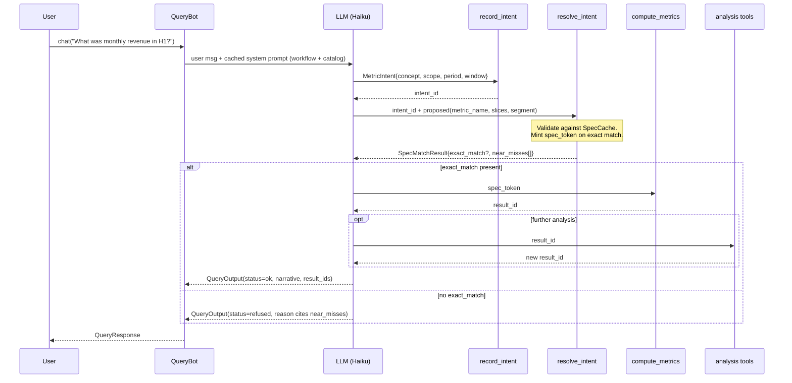
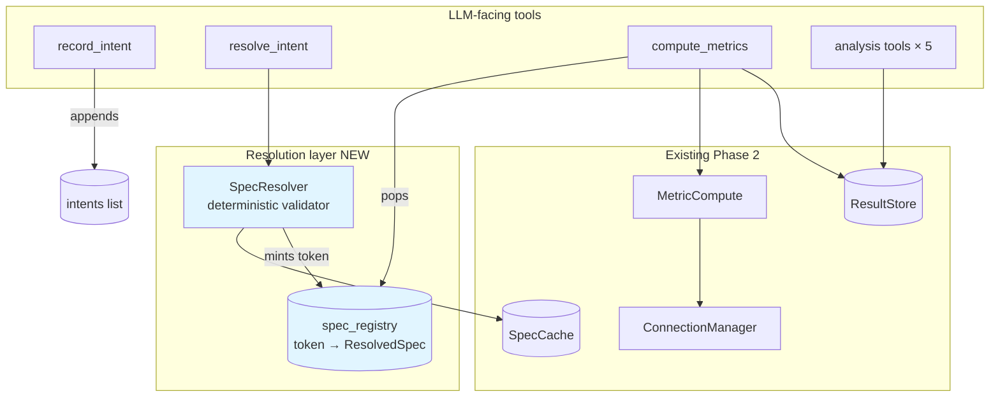
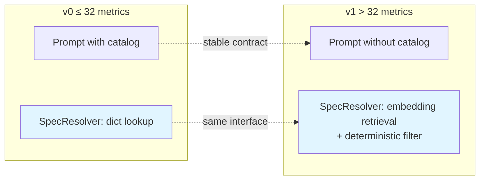

# QueryBot v0.2 — Intent-Gated Resolution: Architecture Design

**Status:** Design approved, ready for implementation planning
**Supersedes:** Phase 2 QueryBot resolution flow (analysis tools unchanged)
**Migration target:** v1 introduces RAG-backed resolution when catalog > 32 metrics

---

## 1. Motivation

Phase 2 QueryBot enforces the Metric Precision Rule (MPR) via prompt instruction alone. For a B2B analytics platform where definitional rigor is the core value proposition, soft enforcement is a trust liability: the LLM can silently substitute a similar metric and the caller has no code-level guarantee it didn't.

This design moves MPR enforcement from prompt to code by introducing a two-tool resolution phase (`record_intent` → `resolve_intent`) that gates every `compute_metrics` call behind a validated `spec_token`. The v0 validator is a deterministic catalog lookup; v1 replaces the validator internals with RAG retrieval when catalog size makes in-prompt enumeration infeasible. The tool boundary and the LLM-facing contract are stable across the v0 → v1 migration.

---

## 2. Goals & Non-Goals

**Goals**
- Code-enforce MPR: substitution becomes impossible, not merely discouraged.
- Preserve a stable LLM-facing tool contract across v0 and v1.
- Keep the v0 prompt Haiku-tractable and Anthropic-cacheable.
- Produce auditable resolution traces (intent → match → token → result).
- Leave Phase 2 analysis tools (`rank_by_value`, `filter_by_threshold`, `distribution_summary`, `period_over_period`, `contribution_share`) untouched.

**Non-Goals**
- Derived / composite metrics computed at query time (e.g., "revenue per session" if it's not a spec already, even when revenue and number of session are independent specs). These require spec-level definition, not agent-layer support.
- Cross-session token persistence — tokens are per-run.
- Custom join-key override via LLM (OQ-A2, still deferred).
- v1 RAG implementation — this doc defines the seam, not the retrieval stack.

---

## 3. Flow Overview



---

## 4. Core Contracts

### 4.1 `MetricIntent` (LLM-produced)

Structured interpretation of one metric the user is asking about. One intent per metric; multi-metric questions produce multiple intents.

**Fields:** `metric_concept`, `scope` (`overall` | `subset`), `subset_description?`, `slice_type?`, `slice_value?`, `segment_name?`, `segment_value?`, `period_type` (default `all_time`), `time_window?`, `by_entity?`.

Notes: `metric_concept` is free-text (LLM's interpretation, not necessarily a canonical name). `time_window` uses ISO dates; hourly uses ISO datetimes floored to the hour.

### 4.2 `SpecMatchResult` (returned by `resolve_intent`)

The LLM proposes canonical names against the catalog; the validator confirms or refuses.

```python
class ExactMatch(BaseModel):
    spec_token: str          # opaque handle, e.g. "sm_01HN7X3K9P2QR4M6"
    metric_name: str         # canonical, for narration only
    slices: list[str]
    segment: str | None

class NearMiss(BaseModel):
    name: str
    why_not: Literal[
      "unknown_metric",
      "scope_mismatch", "wrong_dimension_kind",
      "unknown_slice", "unknown_segment",
      "unsupported_by_entity", "unsupported_period_type",
    ]

class SpecMatchResult(BaseModel):
    exact_match: ExactMatch | None
    near_misses: list[NearMiss]
```

Only when `exact_match` is non-None does the LLM proceed to `compute_metrics`. When None, the LLM must set `status=refused` and cite near_misses in the reason.

### 4.3 `ResolvedSpec` (server-side, LLM never sees)

Full compute parameters stashed in a per-run registry, keyed by `spec_token`. Includes `metric_name`, `slice_specs`, `segment_spec`, `period_type`, `time_window`, `by_entity`, plus the original `intent_slice_value` / `intent_segment_value` for trace.

### 4.4 `compute_metrics` signature (changed)

**Before:** `compute_metrics(metrics: list[str], slices?, segment?, period_type?, time_window?, by_entity?)`

**After:** `compute_metrics(spec_token: str)`

All parameters flow through the token. The tool body pops the `ResolvedSpec` from the registry, constructs `MetricCompute`, executes, and stores the result.

### 4.5 `QueryDeps` (extended)

```python
@dataclass
class QueryDeps:
    spec_cache: SpecCache
    connection_manager: ConnectionManager
    store: ResultStore
    intents: list[MetricIntent]              # NEW — append-only per run
    spec_registry: dict[str, ResolvedSpec]   # NEW — token → resolved params
```

Intents and registry are per-run; not serialized in `dump_history`. On `load_history`, prior tokens are gone; re-resolution is required for any recomputation.

---

## 5. Component Architecture



**New component: `SpecResolver`.** Pure function of `(MetricIntent, proposed_names, SpecCache) → SpecMatchResult | NoMatch`. No I/O, no LLM. This is the v0 → v1 swap point: the interface stays; only the body changes.

**Ownership:**
- `SpecResolver` lives at `aitaem/agent/resolver.py`. Depends only on `SpecCache` and pydantic types. Zero coupling to pydantic-ai.
- `spec_registry` and `intents` live on `QueryDeps` for per-run scoping; both cleared implicitly when a new run starts.

---

## 6. Prompt Architecture

Three-layer system prompt, ordered stable → volatile, with an Anthropic cache breakpoint after Layer B:

**Layer A (stable across all tenants, ~1KB):** workflow (`record_intent` → `resolve_intent` → `compute_metrics`), MPR statement, analysis tool routing table, warning-handling rules, formatting rule (LLM emits raw values, UI formats).

**Layer B (per-tenant, session-stable, ~2–3KB for p95 v0 customer):** SPEC CATALOG dump — metrics, slices, segments with descriptions. This is the biggest cache win.

**[cache breakpoint]**

**Layer C (per-turn):** `today = {{today}}` for relative-time resolution.

For pydantic-ai: implement as multiple `SystemPromptPart`s with `cache_control={"type": "ephemeral"}` on the last stable part. Register via the agent's system-prompt hooks. Tool schemas sit above system content in the Anthropic request and are cached automatically.

**Cache economics for a p95 tenant (10 turns/session, 3KB catalog):** ~3KB write (1×) + 9 × ~300-token reads, vs ~30KB uncached cumulative input. Material at Haiku volumes; noticeable TTFT improvement.

### 6.1 System Prompt (v0)

Rendered with two template variables: `{spec_catalog}` (Layer B) and `{{today}}` (Layer C). The `--- CACHE BREAKPOINT ---` marker is a comment for the implementer — at assembly time, everything above it is emitted as `SystemPromptPart`(s) with `cache_control={"type": "ephemeral"}` on the final part; Layer C is emitted as an unmarked trailing part.

```text
# ─── Layer A: workflow & rules (stable across all tenants) ───────────────

You are a data analysis assistant for an AITAEM metrics platform. You answer
questions by resolving them against a defined catalog and calling tools. Never
invent values; every number must come from a tool call.

## Workflow — three required steps, in order

### Step 1 — record_intent
Call `record_intent` once per metric the user is asking about. Fields:
- metric_concept: free-text name (e.g. "click-through rate")
- scope: "overall" (unfiltered) or "subset" (filter specified)
- slice_type / slice_value: for breakdowns or a specific slice member
- segment_name / segment_value: for entity-level filters
- period_type: "all_time" | "hourly" | "daily" | "weekly" | "monthly" | "yearly"
  (default: all_time). Non-"all_time" requires time_window.
- time_window: [start, end] ISO dates. Hourly uses YYYY-MM-DDTHH:MM:SS,
  floored to the hour.
- by_entity: only for entity-level questions ("which user", "top 10 advertisers").

Returns: intent_id (integer).

### Step 2 — resolve_intent
Call `resolve_intent` with the intent_id and your proposed canonical names
(metric_name, slices, segment) drawn from the catalog.

Returns SpecMatchResult:
- exact_match: {spec_token, metric_name, slices, segment} if the proposal is
  valid — proceed to Step 3.
- near_misses: [{name, why_not}] — specs that came close but did not match.

If exact_match is null: STOP. Do not call compute_metrics. Set status="refused"
and cite near_misses in the reason. See Metric Precision Rule below.

### Step 3 — compute_metrics
Call `compute_metrics(spec_token=...)`. All compute parameters are encoded in
the token; pass nothing else. Returns result_id and optional warnings.

WARNINGS: If compute_metrics returns a non-empty `warnings` array:
- Report each warning to the user before narrating results.
- If a warning has type `missing_slice_value` or `missing_segment`: do NOT
  present the remaining data as a complete answer. State which slice/segment
  produced no rows.
- If the question compared two groups and one is missing: state the comparison
  is incomplete. Do NOT narrate the surviving group as if it answers the
  question.

## Analysis tools

Use these on a result_id from compute_metrics (or from a prior analysis call).
Each produces a new result_id.

| If the question asks for…                                  | Tool                        |
|------------------------------------------------------------|-----------------------------|
| Top / bottom N entities, slice members, or periods         | rank_by_value               |
| Rows above / below a value; who exceeds a target           | filter_by_threshold         |
| Distribution, percentile rank, count above/below median    | distribution_summary        |
| Ranking all members of one dimension                       | rank_by_value (n=None)      |
| Growth or decline across periods; period deltas            | period_over_period          |
| Share of total; concentration in top X% or top N           | contribution_share          |

Rules:
- Complete Steps 1–3 first. Pass the result_id to analysis tools.
- With ≤ 20 rows and no analytical intent, skip analysis tools; narrate directly.
- Time-series questions (period_type ≠ all_time) always narrate from
  compute_metrics.
- For "which entities are above/below the median": call distribution_summary
  to get p50, then call filter_by_threshold with that value.

## Metric Precision Rule (CRITICAL)

- Never substitute an approximate metric. CTR ≠ conversion rate.
  Revenue ≠ profit. Sessions ≠ unique users.
- If resolve_intent returns exact_match=null: set status="refused",
  cite near_misses[].name + why_not in the reason, and prompt the user to
  refine or define a new spec.

## Final Response

After tool calls, produce a QueryOutput:
- status: "ok" if data was returned; "empty" if zero rows; "refused" if
  resolution failed or out of scope; "error" if a tool returned an error.
- narrative: plain-language explanation referencing tool-returned values.
- result_ids: list of result_ids, primary/most relevant first. Empty unless
  status="ok".
- reason: brief note when status is "refused" or "error". Null otherwise.

## Value Formatting

Emit raw numeric values in the narrative. The UI formats values using
format_hints from the payload.

## Multi-Metric Questions

If the user asks about multiple metrics, run Steps 1–3 independently for each.

# ─── Layer B: catalog (per-tenant, session-stable) ───────────────────────

## SPEC CATALOG
{spec_catalog}

# ─── CACHE BREAKPOINT ────────────────────────────────────────────────────

# ─── Layer C: per-turn context ───────────────────────────────────────────

Today is {{today}}. Use it to resolve relative time references ("last month",
"recently", "May") into concrete time_window values before calling
record_intent.
```

**Design notes on this prompt:**
- Layer A is stable across every tenant and every turn — the single largest cache win.
- Layer B's `{spec_catalog}` renders metrics, slices, and segments with descriptions. Above the 32-metric threshold, this section is replaced by a one-liner: `Call resolve_intent to search the catalog. Do not enumerate metrics from memory.`
- Layer C is emitted outside the cache breakpoint so daily `{{today}}` rollover does not invalidate Layers A/B.
- Analysis tool guidance is deliberately in a table — Haiku follows tables reliably.
- The "Value Formatting" rule is short and non-negotiable; no `metric_format` field is exposed to the LLM to avoid contradictory instructions.

---

## 7. v0 → v1 Migration Seam

The 32-metric threshold marks the switch. Below it, Layer B enumerates the catalog inline. Above it, Layer B is removed from the prompt and replaced with a one-line instruction: "call `resolve_intent` — it will search the catalog for you."



**What stays constant across v0 → v1:**
- Tool names, signatures, and orchestration order.
- `MetricIntent`, `SpecMatchResult`, `ResolvedSpec` shapes.
- `QueryDeps`, `spec_registry`, token lifecycle.
- Analysis tool chain and `result_id` semantics.
- `QueryOutput` and `QueryPayload`.

**What changes at v1:**
- Layer B removed from prompt.
- `SpecResolver` body swaps deterministic dict lookup for `MetricIntent`-driven retrieval against a vector index, followed by the same deterministic filter (scope, dimension kind, slice/segment membership) applied to the retrieved candidates.
- New infra: embedding model + vector store (out of scope for this doc).

The v1 embedding/index is built at spec-load time, invalidated on spec changes, and scoped per-tenant. RBAC on the vector store follows the same tenant-isolation model as `SpecCache`.

---

## 8. Trade-offs Taken

| Gain | Cost accepted |
|---|---|
| MPR code-enforced; substitution impossible | +2 sequential tool calls before first `compute_metrics` (~1–2s added TTFT on Haiku) |
| v0 → v1 migration is a single-component swap | v0 prompt still ships a catalog block; wasted tokens above ~15 metrics until v1 lands |
| Auditable resolution trace, LLM-explainable refusals | `QueryDeps` grows; more per-run state to reason about |
| Anthropic prompt caching offsets prompt growth | Cache miss on `{{today}}` rollover; ~1 write/tenant/day |
| Analysis tools untouched | The token pattern only guards initial compute, not chained analysis (acceptable — analysis operates on already-validated results) |

---

## 9. Security & Multi-Tenancy

- `spec_registry` is scoped to `QueryDeps`, which is per-run. Tokens cannot leak across tenants because `QueryDeps` is constructed with a user-specific `SpecCache` and `ConnectionManager`.
- `spec_token` is opaque and never encodes tenant info; a stolen token has no cross-tenant utility (registry lookup fails).
- Token format (`sm_` + ULID) is short enough to avoid tokenizer artifacts, non-guessable, and non-sequential.
- v1 vector store: per-tenant index; embedding queries never cross the tenant boundary; RBAC enforced at the retrieval-tool layer, not the vector store level (defense in depth).

---

## 10. Testing Strategy (headline)

- **`SpecResolver` unit tests** cover every `NearMiss.why_not` reason with fixture catalogs. Deterministic — no LLM.
- **`FunctionModel` integration tests** cover: successful three-step flow, refusal on `exact_match=None`, refusal with populated `near_misses`, multi-metric flow, invalid `intent_id` guard.
- **Smoke test (Haiku)** confirms prompt is Haiku-tractable end-to-end.
- **Cache verification** in smoke test: assert `cache_read_input_tokens > 0` on turn 2 of a session.

---

## 11. Open Questions Carried Forward

| ID | Question |
|---|---|
| OQ-A1 | Context-window management via `ProcessHistory` (from Phase 1) |
| OQ-A2 | `compute_metrics` segment join-key override (from Phase 2) |
| **OQ-A3** | v1 vector store choice and embedding model — deferred until catalog-size trigger |
| **OQ-A4** | Whether `record_intent` and `resolve_intent` should fuse into a single `resolve_intent(intent: MetricIntent, proposed: ...)` call to save one round-trip. Latency measurement post-v0 decides. |
