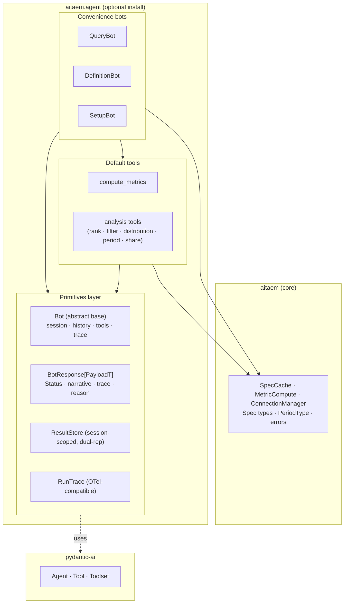
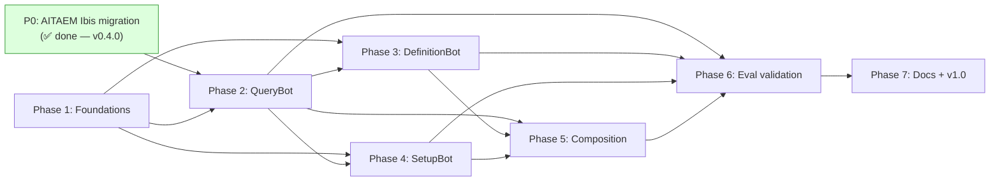
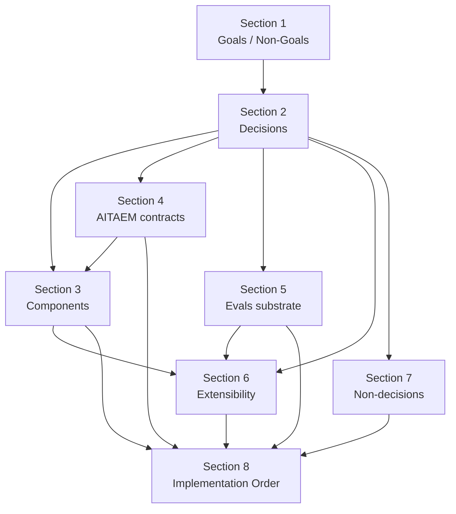

# Architecture: `aitaem.agent` Module

**Version:** 0.2 (Draft, post-AITAEM-v0.4.0)  
**Date:** June 2026  
**Status:** Architecture-level alignment; pending user sign-off on open questions before downstream implementation planning.

---

## Document Map

This is the master document. Each section also exists as a standalone Markdown file in `./` for independent reference:

| # | Section | File |
|---|---|---|
| 1 | Goals & Non-Goals | [`./01-goals-non-goals.md`](./01-goals-non-goals.md) |
| 2 | Architectural Decisions | [`./02-architectural-decisions.md`](./02-architectural-decisions.md) |
| 3 | Component Architecture | [`./03-component-architecture.md`](./03-component-architecture.md) |
| 4 | Contracts with AITAEM Core | [`./04-aitaem-contracts.md`](./04-aitaem-contracts.md) |
| 5 | Evals Substrate | [`./05-evals.md`](./05-evals.md) |
| 6 | Extensibility Surface | [`./06-extensibility.md`](./06-extensibility.md) |
| 7 | Explicit Non-Decisions | [`./07-non-decisions.md`](./07-non-decisions.md) |
| 8 | Implementation Order | [`./08-implementation-order.md`](./08-implementation-order.md) |

---

## Executive Summary

`aitaem.agent` is an **optional install** (`pip install aitaem[agent]`) that ships agent primitives and three opinionated convenience bots — `QueryBot`, `DefinitionBot`, `SetupBot` — on top of AITAEM's deterministic compute layer. The goals: collapse AITAEM onboarding to two lines of code, serve as a blueprint for custom agentic applications, and preserve AITAEM core as a quiet library with no LLM dependencies.

**Foundational decisions:**

- **pydantic-ai** is the agent runtime. Provider-agnostic via model strings.
- **One-way dependency.** `aitaem.agent` depends on `aitaem`; never the reverse.
- **Bot is the session.** Multi-turn (`chat()`) is the primary API; single-turn (`ask()`) is a subset. Bots are constructed per user/session; conversation state lives on the bot.
- **Result store is a bot field.** Tools return minimal LLM-facing summaries to save tokens; full artifacts live in the bot's result store, addressable by ID. History serialization preserves both messages and artifacts.
- **Status is an enum** (`ok | empty | refused | error`), not a bool. The `refused` state is the AITAEM-general version of "no spec precisely answers — don't substitute approximation."
- **Trace is aggregated and OTel-compatible** on each response. Designed eval-friendly from day one. Event-stream hooks are a future extension point.
- **Ibis-based result handling** (AITAEM v0.4.0). Result store carries dual representation (Arrow artifact + optional live Ibis ref). Analysis tools prefer lazy mode for warehouse pushdown; fall back to eager when ref is gone.
- **One `MetricCompute` per bot, lifetime tied to bot lifetime.** Live Ibis refs reference into the `MetricCompute`'s execution context (including the v0.4.0 cross-backend scratch DuckDB); per-call lifetimes would invalidate refs prematurely.
- **AITAEM operational parameters pass through opaquely** via `compute_kwargs: dict | None`. AITAEM owns its parameter surface; the bot has no opinion to encode.

**Evals.** The architecture commits to a substrate (OTel-compatible trace + portable history + result retrieval). Library choice is the user's call; recommended primary is **pydantic-evals**, complemented by **deepeval** when RAG flows arrive. Inspect AI is recommended for future capability/safety benchmarks.

**Implementation order.** AITAEM v0.4.0 (Ibis-return migration + cross-backend `tmp_dir`) is shipped, satisfying the hard prerequisite. The module builds in seven phases: foundations → QueryBot → DefinitionBot → SetupBot → composition primitives → eval validation → docs and v1.0 release.

**Open questions for user decision before downstream planning:**

1. Eval library choice — concur with pydantic-evals primary recommendation, or pick differently? (Section 5, §4)
2. Ship a reference eval harness in the repository, or document the substrate only? (Section 5, §6; Section 7, ND-09)
3. Concur with the implementation phasing in Section 8?

---

## 1. Goals & Non-Goals

> Full text: [`./01-goals-non-goals.md`](./01-goals-non-goals.md)

### Goals (G1–G8)

- **G1.** Two-line AITAEM onboarding via convenience bots.
- **G2.** Self-evidencing blueprint for AITAEM extension.
- **G3.** One-way dependency, optional install — `aitaem` core remains LLM-free.
- **G4.** Multi-turn architecture from day one.
- **G5.** Eval substrate compatibility (trace + history + result retrieval).
- **G6.** Token-efficient by construction (tools return summaries; artifacts live in result store).
- **G7.** Provider-agnostic LLM layer via pydantic-ai model strings.
- **G8.** Composable tool surface (constructor / add / per-call).

### Non-Goals (NG1–NG9)

- **NG1.** Credential storage, persistence, multi-tenancy, RBAC.
- **NG2.** Streaming response API in v1.
- **NG3.** Event-stream observability hooks in v1.
- **NG4.** Typed error taxonomy in v1.
- **NG5.** Rich default-prompt customization API in v1.
- **NG6.** Locked default tool catalogue beyond the working set.
- **NG7.** Tool removal (per-call injection covers the scoped case).
- **NG8.** Hosting — AITAEM stays a PyPI library.
- **NG9.** Hot-reload of `SpecCache`.

Section 1 elaborates each with rationale.

---

## 2. Architectural Decisions

> Full text: [`./02-architectural-decisions.md`](./02-architectural-decisions.md)

Fifteen committed decisions. Listed compactly here; consult Section 2 for context, rationale, and consequences per decision.

| ID | Decision |
|---|---|
| AD-01 | `aitaem.agent` is an optional install (`aitaem[agent]`); one-way dependency from agent to core |
| AD-02 | pydantic-ai is the agent runtime; provider-agnostic via model strings |
| AD-03 | Module shape: primitives layer + convenience bots layer, both first-class |
| AD-04 | Bot is the session; constructed per user/session |
| AD-05 | Result store is a bot field; responses carry IDs; history serialization includes artifacts |
| AD-06 | Per-bot typed response payloads over a common base |
| AD-07 | `Status` is an enum (`ok / empty / refused / error`), not a bool |
| AD-08 | Aggregated `RunTrace` on response now; event-stream hooks later |
| AD-09 | Architecture commits to eval substrate, not framework; substrate is OTel-compatible |
| AD-10 | Tools return minimal LLM-facing summaries; full artifacts in result store |
| AD-11 | Tool composition: constructor `tools=[...]`, `add_tool()`, per-call `extra_tools=[...]` |
| AD-12 | Ibis-based dual-representation result store (AITAEM v0.4.0) |
| AD-13 | STANDARD_COLUMNS accessed by name, never by index |
| AD-14 | No raw YAML parsing in the agent module; typed attributes only |
| AD-15 | Multi-turn is architectural default; `ask()` is a subset |
| AD-16 | One `MetricCompute` per bot, lifetime tied to bot lifetime |
| AD-17 | AITAEM operational parameters pass through opaquely via `compute_kwargs` |

---

## 3. Component Architecture

> Full text: [`./03-component-architecture.md`](./03-component-architecture.md)



### Components in one paragraph each

- **Primitives layer:** `Bot` (abstract base owning session, history, tools, trace assembly), `BotResponse[PayloadT]` (status / narrative / trace / reason / typed payload), `ResultStore` (session-scoped dict of result IDs to artifacts, with optional live Ibis refs), `RunTrace` (per-turn OTel-compatible aggregated record), history I/O surface (`dump_history()` / `load_history()` serializing messages and artifacts together).
- **Convenience bots layer:** `QueryBot` (compute + analysis on AITAEM specs), `DefinitionBot` (schema introspection + spec generation + validation), `SetupBot` (connection wizard returning config; caller persists).
- **Default tools:** `compute_metrics` (the single AITAEM-touching tool, post-Ibis-migration aware) + five analysis tools operating on result store entries.
- **Caller responsibilities:** building `SpecCache` and `ConnectionManager`, choosing the model, per-user lifecycle, persisting history if desired, rendering responses. The library handles none of these.

A typical multi-tool turn (compute → rank → narrate) is illustrated as a sequence diagram in Section 3, §5. Key property: the LLM never sees the full DataFrame; only summaries. The caller dereferences result IDs after the turn.

---

## 4. Contracts with AITAEM Core

> Full text: [`./04-aitaem-contracts.md`](./04-aitaem-contracts.md)

**One-way:** `aitaem.agent` → `aitaem`. Never reverse. Enforced by CI import-graph check.

**Imports from `aitaem` top level (no submodules):**
- Types: `SpecCache`, `MetricSpec`, `SliceSpec`, `SegmentSpec`, `IbisConnector`, `ConnectionManager`, `MetricCompute`, `PeriodType`, `METRIC_FORMAT_VALUES`, `ValidationResult`.
- Exceptions: `SpecValidationError`, `SpecNotFoundError`, `QueryBuildError`, `QueryExecutionError`, `AitaemConnectionError`.

**Assumed AITAEM v0.4.0 behaviors:**
- `MetricCompute(spec_cache, connection_manager, **compute_kwargs)` — bot constructs one per its lifetime (AD-16).
- `MetricCompute.compute(...)` returns `ibis.Table` (lazy).
- `.to_pandas()` / `.to_pyarrow()` for explicit materialization.
- `tmp_dir` and other operational kwargs forwarded opaquely via the bot's `compute_kwargs` (AD-17).
- `STANDARD_COLUMNS` schema (11 columns) accessed by name; metadata columns identifiable by name set; `metric_value` is the value column.

**The agent module never:**
- Imports from `aitaem` submodules.
- Parses raw spec YAML.
- Handles credentials directly.
- Instantiates `IbisConnector` or backend-specific connections.
- Persists anything to disk or network.
- Picks defaults for AITAEM operational parameters.

Section 4 documents the full surface plus the dual-representation result store mandated by the Ibis migration.

---

## 5. Evals Substrate

> Full text: [`./05-evals.md`](./05-evals.md)

### The substrate

Three things the architecture surfaces for any eval harness:

1. **`RunTrace` per response.** OTel-compatible by design. Each `ToolCall` carries name, structured args, result ID, LLM-facing summary, success, duration. Replay-sufficient given `(history-before-turn, user message, trace)`.
2. **`dump_history()`.** JSON-serializable, portable record of the conversation.
3. **`bot.get_result(result_id)`.** On-demand access to materialized artifacts for ground-truth comparison.

**Why this is special:** AITAEM's deterministic compute means evals can include exact-correctness checks (does the computed DataFrame equal the known ground truth?), not just LLM-as-judge on narrative. This is a stronger signal than most LLM apps can produce.

### Library trade-off summary

| Dimension | pydantic-evals | deepeval | Inspect AI |
|---|---|---|---|
| Alignment with pydantic-ai | Native (same authors) | Pytest integration first-class | Generic; solver wrapper |
| Tool-call evaluation | OTel span_tree (structural) | `ToolUseMetric` (LLM-judge) | Solver/scorer (flexible) |
| Multi-turn ergonomics | Roll your own | `ConversationalTestCase` (turnkey) | Native |
| Deterministic correctness | Excellent (EqualsExpected, span checks) | Possible via custom metrics | Excellent |
| RAG metrics out-of-box | None | RAG triad + multi-turn RAG | None |
| Observability | OTel + Logfire native | Confident AI cloud (opt-in) | Built-in viewer |
| LLM-judge bias | Minimal | Pervasive | Optional |
| Adoption / maturity | Newer, well-built | Established, broad | Mature (AISI / labs) |

### Recommendation (non-binding)

**Primary: pydantic-evals.** Tightest alignment with our trace substrate (OTel span_tree), strongest deterministic-correctness story, native Logfire/OTel for observability synergy.

**Complement: deepeval, for RAG flows when they arrive.** Mature RAG triad and multi-turn RAG metrics that pydantic-evals doesn't have. Two frameworks coexist trivially.

**Future option: Inspect AI** for capability/safety benchmarks (prompt injection resistance, etc.). Post-v1.

Section 5 details the substrate, candidate analysis, and explicitly flags the open question of whether to ship reference evals in the repository.

---

## 6. Extensibility Surface

> Full text: [`./06-extensibility.md`](./06-extensibility.md)

Five extension points:

| ID | Surface | Use case |
|---|---|---|
| EP1 | Custom tools (constructor / add / per-call) | Add domain logic; e.g. logging or auditing tools |
| EP2 | Bot composition via `as_tool()` | Cross-bot delegation; orchestration without an orchestrator class |
| EP3 | Custom bots from primitives | Downstream apps building their own bots on the primitives layer |
| EP4 | Prompt overrides (subclass-first; richer API later) | Customize default prompts per deployment |
| EP5 | Response payload extension | App-specific UX fields (e.g. visualization hints) in a payload subclass |

**Stability guarantees:**
- Convenience bot constructors and primitives base classes: semver-stable.
- Default tool input/output schemas: semver-stable.
- Default prompts: public but not semver-stable in content (tuning is expected).
- `RunTrace` and `BotResponse` field shapes: semver-stable (eval substrate is contract).

**Not enabled:** modifying result store schema, removing default tools by name, hot-swapping the LLM runtime away from pydantic-ai, persistent state owned by the bot.

---

## 7. Explicit Non-Decisions

> Full text: [`./07-non-decisions.md`](./07-non-decisions.md)

Nine things deliberately deferred, each with an "escape valve" describing the path forward we leave open:

| ID | Non-decision | Escape valve |
|---|---|---|
| ND-01 | Streaming response API | `chat_stream()` as parallel method later |
| ND-02 | Event-stream observability hooks | `bot.on(...)` / `bot.events` async iterator |
| ND-03 | Typed error taxonomy | Additive `error_kind` enum later |
| ND-04 | Rich prompt customization API | Kwarg / fragment / registry — all purely additive |
| ND-05 | Default analysis tool catalogue composition | Refine in v1.x based on usage data |
| ND-06 | Cost/token-budget controls | Wrap pydantic-ai's `UsageLimits` later |
| ND-07 | Hot-reload of `SpecCache` | `bot.reset(spec_cache=...)` later |
| ND-08 | Concurrent calls on same bot | Document as unsupported; lock if needed |
| ND-09 | Reference eval harness in repo | **Open question for user decision** |

Each non-decision identifies the trigger that would cause us to revisit it.

---

## 8. Implementation Order

> Full text: [`./08-implementation-order.md`](./08-implementation-order.md)



**Phases:**

- **P0** — AITAEM Ibis-return migration + `tmp_dir` cross-backend support. **Shipped in AITAEM v0.4.0.** Phase 2 unblocked.
- **Phase 1 — Foundations.** Package structure, optional install, primitives skeleton, trace assembly. Can run in parallel with Phase 2 prep.
- **Phase 2 — QueryBot.** `compute_metrics` against bot-held `MetricCompute` (AD-16), five analysis tools (lazy-mode-aware), default prompt with Metric Precision Rule, integration, end-to-end multi-turn tests. **Largest phase; bulk of architectural risk lives here.**
- **Phase 3 — DefinitionBot.** Schema introspection tools, spec validation tool, integration.
- **Phase 4 — SetupBot.** Connection-validation tool, integration.
- **Phase 5 — Composition.** `bot.as_tool()`, `add_tool()` / `add_bot()` / per-call `extra_tools`, cross-bot composition tests.
- **Phase 6 — Eval substrate validation.** Reference eval harness (if user opts in), OTel span emission verification.
- **Phase 7 — Docs + v1.0 release.** Public API docs, getting-started examples, shipped to PyPI.

**Risk concentration:** Phase 2. Specific risks: trace assembly faithfulness, tool-summary-vs-store split sufficiency, Metric Precision Rule effectiveness in practice. Each has been worked through against concrete scenarios in the design process, which is why risk is rated medium not high.

---

## Cross-section dependency map

How sections relate, for orientation:



- Sections 1 and 2 establish the foundational position.
- Section 3 (components) is informed by Section 2 (decisions) and Section 4 (what flows in from AITAEM).
- Sections 5 (evals), 6 (extensibility), and 7 (non-decisions) refine specific surfaces.
- Section 8 sequences everything into an implementation plan.

---

## Open Questions Awaiting User Decision

Before downstream implementation planning begins:

### OQ-1: Eval library choice

Architecture recommends **pydantic-evals primary + deepeval for RAG**. User confirms or selects differently. See Section 5, §4.

### OQ-2: Reference eval harness in the repository?

(a) Ship `tests/evals/` examples demonstrating pydantic-evals wiring — self-evidencing for users.
(b) Document the substrate only — keeps library leaner.

Architecture leans (a) for consistency with the blueprint philosophy (G2). See Section 5, §6 and Section 7, ND-09.

### OQ-3: Implementation phasing

With AITAEM v0.4.0 shipped, P0 is done. Phase 1 (foundations) and Phase 2 prep can begin in parallel. Confirm this sequencing, or push back on a different ordering.

### OQ-4: AITAEM-side coordination — closed

AITAEM v0.4.0 delivers the Ibis-return `compute()` and adds `tmp_dir` for cross-backend materialization. The dual-representation result store (Section 3, Section 4 §4) is realizable with the v0.4.0 API. AD-16 (one `MetricCompute` per bot) and AD-17 (opaque `compute_kwargs`) address the lifetime and forward-compatibility consequences.

Any residual coordination — for instance, AITAEM-side feedback on how the bot uses `tmp_dir` in multi-tenant scenarios — is post-v1.0 territory.

### OQ-5: Context-window management for long-running sessions

**Problem:** In multi-turn conversations, the accumulated `message_history` passed to each `agent.run()` call grows unboundedly. If history + system prompt + current message exceeds the model's context window, the call fails.

**Solution direction:** pydantic-ai's `ProcessHistory` capability (in `pydantic_ai.capabilities`). Pass a processor callable at agent construction time:

```python
from pydantic_ai.capabilities import ProcessHistory

Agent(model=..., capabilities=[ProcessHistory(my_trimmer)])
```

The processor receives the full message list before every model request and returns a modified list. No built-in trimmer exists in pydantic-ai — must be implemented.

**Key constraint (pydantic-ai issue #2050):** The processor fires before *every* model request, including each step of a tool-call loop. The message list it receives includes mid-run tool call/return pairs. Naive trimming that drops a `ToolReturnPart` without its matching `ToolCallPart` violates provider API constraints. Any trimmer must only remove complete call/return pairs as an atomic unit.

**Token counting:** pydantic-ai provides no tokenizer. A safe approximation is character-count or message-count based trimming. Provider-accurate trimming requires an external tokenizer (e.g. `tiktoken` for OpenAI, already available when `[agent-openai]` is installed).

**Where it lives in code:** `_build_agent()` in each concrete `Bot` subclass. The `Bot` base class docstring (Phase 1) already documents this hook so Phase 2+ implementors know where to plug in.

**Why unscheduled:** Context overflow only matters in practice once real multi-turn sessions run long enough to hit limits. Monitor whether it surfaces as a real issue in Phase 2 integration testing before committing implementation effort.
